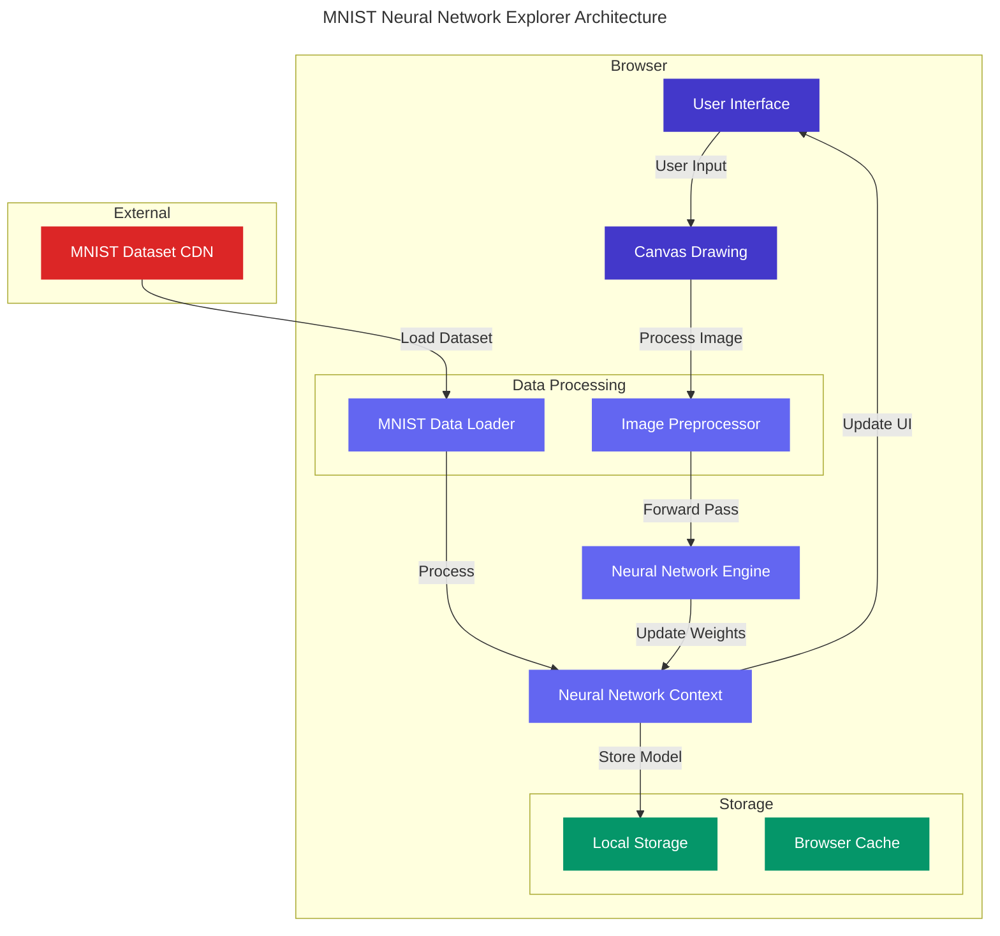

# MNIST Neural Network Explorer

An interactive web application for exploring and understanding neural networks through the MNIST dataset. Train a neural network in your browser and watch it learn to recognize handwritten digits in real-time.

## Features

- **Interactive Dataset Exploration**
  - Browse through the MNIST training dataset in single or grid view
  - Examine individual digits with adjustable size
  - View 100 digits at once in a 10x10 grid layout

- **Neural Network Training**
  - Train a 3-layer neural network directly in your browser
  - Customize training parameters (epochs, learning rate, batch size, hidden nodes)
  - Real-time training progress and accuracy visualization
  - Network architecture visualization showing weights and connections

- **Model Testing**
  - Draw digits using mouse or touch input
  - Test against real MNIST test images
  - View prediction confidence for each digit
  - Analyze model performance through confusion matrix

## Installation and Setup

1. Clone the repository:
   ```bash
   git clone https://github.com/yourusername/mnist-neural-network-explorer.git
   cd mnist-neural-network-explorer
   ```

2. Install dependencies:
   ```bash
   npm install
   ```

3. Run the development server:
   ```bash
   npm run dev
   ```

4. Open [http://localhost:3000](http://localhost:3000) in your browser

## Project Structure

```
src/
├── components/           # React components
│   ├── explore/         # Dataset exploration components
│   ├── ui/             # Reusable UI components
│   └── ...             # Main feature components
├── context/            # React context providers
├── hooks/             # Custom React hooks
├── lib/               # Core functionality
│   ├── mnist.ts       # MNIST data loading and processing
│   └── neural-network.ts # Neural network implementation
└── pages/             # Next.js pages
```

## Architecture

The application follows a modular architecture with clear separation of concerns:



### Component Interactions

1. **Data Flow**
   - MNIST dataset is loaded from CDN and processed by the Data Loader
   - Neural Network Context manages state and model parameters
   - User interactions trigger canvas updates and predictions
   - Model state is persisted in Local Storage

2. **Key Components**
   - **UI Layer**: React components for user interaction
   - **Neural Network Context**: Central state management
   - **Processing Layer**: Image preprocessing and neural network computations
   - **Storage Layer**: Model persistence and data caching

3. **Performance Optimizations**
   - Browser caching for MNIST dataset
   - Local storage for trained model persistence
   - Efficient canvas operations for drawing
   - Optimized matrix operations for network computations

## Neural Network Implementation

The application implements a 3-layer feedforward neural network:

- **Input Layer**: 784 nodes (28x28 pixels)
- **Hidden Layer**: Configurable (default 128 nodes)
- **Output Layer**: 10 nodes (digits 0-9)

### Key Features:
- **Forward Propagation**: Uses ReLU activation for hidden layer and softmax for output
- **Backward Propagation**: Implements stochastic gradient descent
- **Training Process**: 
  - Runs entirely in JavaScript on the client-side CPU
  - Uses mini-batch processing for efficiency
  - Implements cross-entropy loss function
  - Supports customizable learning rates and batch sizes

### Data Processing:
- Normalizes pixel values to [0,1] range
- Implements proper centering and scaling of drawn digits
- Uses anti-aliasing for better quality digit recognition

## Performance

- **Training Data**: Uses a subset of 3,000 training images and 1,000 test images for faster loading
- **Training Time**: ~2-3 minutes for 30 epochs on modern browsers
- **Model Size**: ~400KB when exported (weights + biases)
- **Recognition Accuracy**: 
  - ~92-95% on MNIST test set
  - ~85-90% on hand-drawn digits

### Optimization Techniques:
- Progressive data loading
- Efficient matrix operations
- Canvas optimization for drawing
- Web Workers for background processing (coming soon)

## Contributing

Contributions are welcome! Here's how you can help:

1. Fork the repository
2. Create a feature branch: `git checkout -b feature/amazing-feature`
3. Commit your changes: `git commit -m 'Add amazing feature'`
4. Push to the branch: `git push origin feature/amazing-feature`
5. Open a Pull Request

### Areas for Improvement:
- GPU acceleration support
- Additional network architectures
- Extended dataset support
- Performance optimizations
- Mobile responsiveness
- Accessibility improvements

## License

This project is licensed under the MIT License - see below for details:

```
MIT License

Copyright (c) 2024 [Your Name]

Permission is hereby granted, free of charge, to any person obtaining a copy
of this software and associated documentation files (the "Software"), to deal
in the Software without restriction, including without limitation the rights
to use, copy, modify, merge, publish, distribute, sublicense, and/or sell
copies of the Software, and to permit persons to whom the Software is
furnished to do so, subject to the following conditions:

The above copyright notice and this permission notice shall be included in all
copies or substantial portions of the Software.

THE SOFTWARE IS PROVIDED "AS IS", WITHOUT WARRANTY OF ANY KIND, EXPRESS OR
IMPLIED, INCLUDING BUT NOT LIMITED TO THE WARRANTIES OF MERCHANTABILITY,
FITNESS FOR A PARTICULAR PURPOSE AND NONINFRINGEMENT. IN NO EVENT SHALL THE
AUTHORS OR COPYRIGHT HOLDERS BE LIABLE FOR ANY CLAIM, DAMAGES OR OTHER
LIABILITY, WHETHER IN AN ACTION OF CONTRACT, TORT OR OTHERWISE, ARISING FROM,
OUT OF OR IN CONNECTION WITH THE SOFTWARE OR THE USE OR OTHER DEALINGS IN THE
SOFTWARE.
```
